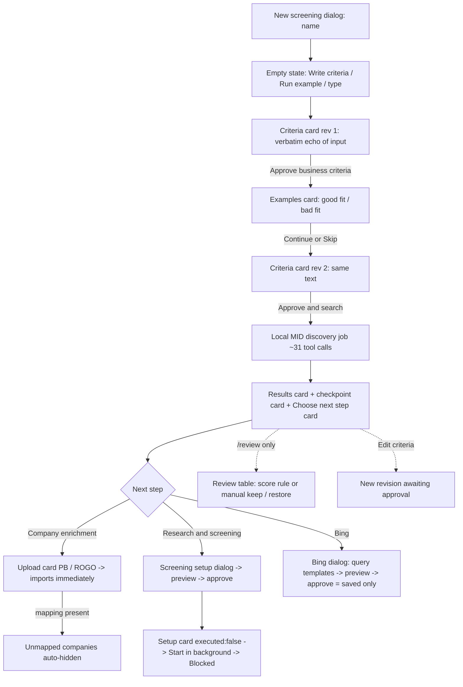

# Current flow audit

How the screening app behaves today, recorded from a live walkthrough. Use it as the
baseline for defining the target flow.

- **Build audited:** `main` @ `2f7ec43` (running from `outputs/`, identical to remote)
- **Date:** 2026-10-06
- **Setup:** `pnpm start` (UI :4173, bridge :7319, Rust :17318). Providers disconnected.
- **Viewports:** 1440×900 (desktop), ~800×500 (in-app pane), 375×812 (phone)
- **Test screening:** "Flow audit - insurance", custom criteria (not `/example`)
- Screenshots are in `screens/`.

---

## 1. Surface map

The app has **one shell** with many overlapping surfaces showing the same state.

| Surface | Where | What it holds |
|---|---|---|
| **Sidebar** | left | New screening, search, screenings list, Commands (Ctrl+K), Prompt library, "Local workspace" status |
| **Header** | top | Screening name (rename) + status line, **Screen / ask** menu, **Chat / Workspace** toggle, Appearance (System/Light/Dark), 📁 *Files and results* (opens an inspector panel), 🕑 *Background runs* (opens an inspector panel), **Session log** |
| **Chat view** | main | assistant-ui thread: user messages, assistant text, artifact cards, tool-call timelines, composer |
| **Workspace view** | main | Tabs **Overview / Companies / Files**, with the chat docked on the right (desktop) |
| **Chat dock** | right of Workspace | Same thread as Chat, narrow; expand / open full chat buttons |
| **Inspector panel** | right overlay | Either *Screening overview* (shortlist counts, context sources, criteria) or *Background runs* (discovery jobs) |
| **Background screening dock** | bottom-right floating | Provider runs across *all* screenings ("4 runs · 0 of 9 batches") |
| **Dialogs** | modal | New screening, Edit criteria, Prompt library, Commands, Screening setup (+ Add source fields), Bing research, Session log |
| **Toasts** | bottom-center | e.g. "6 companies kept. Recommendations updated." |

**Composer controls:** attach (📎), prompt library (≡), runtime selector (*Screening assistant / LLM Suite / M365 Copilot*), send. `/` opens command suggestions; `@` (after discovery) mentions a company.

**Slash commands:** `/llm`, `/copilot`, `/screen`, `/example`, `/criteria`, `/data`, `/bing`, `/review`, `/companies`, `/plan`, `/memory`, `/flow`, `/checkpoint`, `/export`.

---

## 2. Observed flow, step by step

### S0 · Create a screening
- **New screening** → modal asking only for a name (`01`). Creates an empty screening and switches to it.
- Lands on whatever view was last used (here: Workspace) with an empty state (`02`).
- Four separate start entry points on one screen: Overview "Start in chat", Overview "Run the example", dock "Write your criteria", dock "Run the example".
- "Write your criteria" pre-fills `Find companies that ` (with a trailing space) into the composer.

### S1 · Criteria draft (revision 1)
- Sending a description produces a **Business criteria** card, `Awaiting approval · revision 1` (`03`).
- The "draft" is the input **echoed verbatim**; no structuring and no deferred criteria are extracted. The local path is deterministic.
- The card appears twice at once: in the chat and in Workspace › Overview.
- Actions: **Approve business criteria**, **Decline**, **Edit criteria**.
- **Edit criteria** dialog (`04`) has two near-identical textareas, *Screening brief* and *Core business definition*, both containing the same text. It doesn't say how they differ.

### S2 · Fit examples (optional)
- After the first approval, an **Examples · optional** card appears (`05`), **in chat only** (Overview doesn't show this step).
- Two boxes: Good fits / Bad fits. Buttons: **Continue to final review**, **Skip examples**.
- After Continue, the card collapses to "Examples saved with this criteria revision" **without showing what was saved**.
- Assistant: "LLM Suite is not connected to interpret them yet."
- **The examples go nowhere visible**: they don't change the criteria text and they are absent from the screening prompt (verified).

### S3 · Final approval → discovery
- A second criteria card, `Awaiting approval · revision 2`, has the same text as rev 1 (`06`). Button: **Approve and search**.
- Every button click is also posted as a fake user message ("Approve business criteria", "Approve final criteria and find companies").
- The Overview stepper ("What happens next") showed *Approval: Needs your review* even after the first approval. The two-stage approval isn't reflected there.
- Discovery runs as a local job (`08`): header badge "Search running", status line truncated ("…or open another screeni").
- Finishes in ~1 s with **31 tool calls** shown as a collapsible timeline.

### S4 · Results and next step
Three cards are appended:
1. **7 companies considered** (`09`): counts (MID only / ISCC only / both), a table (name, labelled description, source·domain, MID score, ISCC score "—"), "Show all 7", and exports **PitchBook / LLM Suite / Full data**.
2. **Progress saved**: checkpoint, *Inspect checkpoint*.
3. **Choose the next step** (`10`): "7 companies in your shortlist", "Context available from PitchBook, ROGO", and two collapsible groups:
   - *Company enrichment*: Add PitchBook data (Recommended), Add ROGO data
   - *Research and screening*: Bing research (Recommended), LLM Suite screening, M365 Copilot screening (Recommended)
- These cards update live later (e.g. "6 companies in your shortlist" after a hide).
- **Workspace › Companies** (`11`): AG Grid with search, source filter (All/MID/ISCC/Both), exports, columns Company/Source/HQ/MID/ISCC (ISCC is clipped off the right edge at 1440 px with the dock open). The count line reads "7 of 7 in shortlist".
- Clicking a row **replaces the grid** with a detail view (`12`): scores, description, IDs, website, analyst notes, **Save notes**, **Ask agent**.
- **There is no hide / keep / restore control in the grid or the detail view.**

### S5 · Review shortlist (hide / keep / restore)
- Reachable **only** via `/review` (or `/data`, which renders the identical card). There's no button anywhere else (`13`).
- The card (`15`):
  - **Score rule**: Score column dropdown + Minimum score (default 7) + "Exclude companies without a score" + "Keep CHECK results" + Preview matches. **Before any provider screening the dropdown has no options**, so this half is a dead end.
  - **Manual**: AG Grid with checkboxes (index, pk, PBId, Company, Website, Description…). The grid viewport is **~3 rows tall** (`16`).
  - Buttons: **Restore all (n)**, **Keep selected (n)**, **Keep matches (n)**.
- Unticking 1 row → **Keep selected (6)** → "6 companies remain considered" + toast (`17`). Header, counts and next-step card all update.
- In the chat dock the card is unusably narrow (`14`).
- Every earlier `/review` card stays **active** with stale status text ("6 companies remain considered" while 7 are considered).
- Workspace grid shows "1 of 1 in shortlist · 6 hidden" but **cannot list or restore hidden companies** (`21`).

### S6 · Company enrichment (PitchBook / ROGO)
- From the next-step card: **Add PitchBook data** → upload card with PitchBook/ROGO tabs, drop zone, Browse files (`19`).
- **Dropping files imports immediately**, with no confirm step.
- With a mapping CSV present, the import is called with `exclude_unmapped: true`. **Every company not in the mapping is hidden.**
  - Observed: shortlist went **6 → 1** (`20`). The card said only "1 PitchBook IDs, 1 PitchBook company records and 0 ROGO records matched. 0 rows unmatched; 0 rows need review."
  - **Nothing tells the analyst that 5 companies were hidden** or how to get them back.
- Restoring requires running `/review` again → **Restore all**.

### S7 · Provider screening setup (LLMSuite / M365)
- Entry: header **Screen / ask** menu (`23`): LLMSuite screening, Ask LLMSuite, M365 Copilot screening, Ask M365 Copilot, Bing research. Also reachable from the next-step card and `/screen`.
- **Screening setup** dialog (`24`), in three numbered sections:
  1. *Data in, results out*: input column chips (index pinned, pk, PBId, Company Name, Website, Description, LinkedIn URL), **Add sources** sub-dialog (per-source raw fields with coverage counts + PB→MID→ISCC precedence for name/website/description), output column chips (Fit Score, Rationale).
  2. *Instructions and capacity*: model/deployment ("Use automatic"), companies per batch (25), prompt textarea (generated), "Generate prompt with AI", capacity line.
  3. *Review sample*: **Generate preview** shows real projected rows (first 4).
- **Approve and save setup** is locked until preview.
- After approval: a **Screening setup** card "Approved input snapshot · executed: false" with **Start in background** / **Edit a new version**.
- **Start in background** gives no feedback in the chat. The run appears in the Background screening dock as *Blocked: "Provider connection is unavailable. No request was sent."* The button stays clickable.
- The generated prompt contains the criteria but **not the good/bad-fit examples**.

### S8 · Background screening dock
- Floating bottom-right on every screen, every screening.
- Lists runs from **all** screenings. Older ones are labelled just "Screening" and are stuck as *Blocked: "This screening setup is no longer current."*, never cleared.
- The header counts blocked runs ("4 runs · 0 of 9 batches").
- Mixed time formats: `09:41:51 AM`, `1:41 AM`, `01:41 AM`, `10/6/2026, 1:30:46 AM`.
- It's separate from the 🕑 **Background runs** inspector, which lists *discovery* jobs. Two different "background" concepts.

### S9 · Bing research
- Dialog: Company research vs General query; "All 7 companies will be considered"; 1–5 editable query templates; Generate with AI; **Preview queries**. Disconnected → approval only saves.
- **Template bug:** template 1 reads *"Does {company} provide find companies that  sell claims management…?"*: the raw criteria sentence is pasted into the template.

### S10 · Direct questions
- **Ask LLMSuite** / **Ask M365 Copilot** opens no dialog. It silently switches the composer runtime selector.
- A sent question returns "LLM Suite is not connected yet. No provider request was sent." + an *Executed: no* card.
- **The runtime stays on LLM Suite** for later messages; slash commands still run locally.

### S11 · Revising criteria after approval
- **Edit criteria** → Save draft creates `revision 3 · Awaiting approval`, with a single approval (no examples step this time). The edit is posted as a fake `/criteria` user message.
- Header changes to "Review criteria before searching", but **Workspace still shows 7 companies** and the grid is unchanged. The docs say editing clears the displayed results, so the docs and the UI disagree.

### S12 · Other commands and panels
| Item | Observed |
|---|---|
| `/data` | Same "Review company data" card as `/review` (the description promises a source table) |
| `/flow` | Status list + Mermaid diagram. Says "Choose data or screening: Queued" while "Save progress and export: Done" |
| `/memory` | Shows **one** company (Northstar) only; label text runs together ("imported company dataCompany ECID…") |
| `/checkpoint` | Raw JSON dump |
| Prompt library (`07`) | Searchable templates (Describe a business, Use company examples, Add PitchBook data, Add ROGO data…), editable, **Use prompt** inserts into the composer |
| Commands, Ctrl+K (`26`) | Same list as slash commands |
| 📁 *Files and results* (`27`) | Opens a **third "Screening overview"**, not a file list. Shows "PitchBook 1 companies updated", "ROGO 2 companies updated" |
| 🕑 *Background runs* | Discovery jobs across screenings + "0 external subagents connected" |
| Session log (`25`) | 103 events for this short session; search, kind/status filters, timing overview, record inspector (Summary/Input/Output/Raw/Timing), Markdown / JSONL / Full ZIP |
| Exports | Not clicked (they download files) |

---

## 3. State model (as implemented)

- **Criteria:** revision N → `Awaiting approval` → (`Business criteria reviewed` →) `Approved`. The first pass needs 2 approvals; later edits need 1.
- **Company:** `considered` or `hidden` (per run). Hidden rows stay in history. Counts, recommendations, setups and exports use considered companies.
- **Company context (PitchBook/ROGO):** stored **globally per company**. `company_enrichment` has no run ID, so data uploaded in one screening appears in every other screening containing that company.
- **Provider setup:** prepared plan (digest) → approved (`executed:false`) → background run (Blocked when disconnected / stale when inputs change).
- **Discovery job:** process-local; lost on server restart.

**Next-step recommendation rules** (strict, on considered count *n*): PitchBook + Bing if 0<n<1000; ROGO if 500<n<2000; LLMSuite if n>2000; M365 if 0<n<250 **and** PB context exists. *Research and screening* opens first if n>5000, any PB/ROGO/Bing context exists, or 0<n<500.

---

## 4. Findings

### Bugs
| # | Severity | Finding | Repro |
|---|---|---|---|
| B1 | High | PitchBook mapping **silently hides** every unmapped company (6 → 1). The result card says "0 rows unmatched" | Upload `examples/pitchbook-mapping.csv` + data on a 6+ company list |
| B2 | High | **Enrichment leaks across screenings.** A brand-new screening shows "Context available from PitchBook, ROGO", PB descriptions, ROGO "2 companies", and M365 "Recommended" | New screening → search; never upload anything |
| B3 | Med | Uploaded mapping's PBId (`PB-UI-001`) doesn't replace the existing one (`PB-EXAMPLE-001` from another screening) | Same as B1 after B2 |
| B4 | Med | Good/bad-fit examples are saved but **never used** (not in criteria, not in the screening prompt) | S2 → open Screening setup and read the prompt |
| B5 | Med | Bing template 1 is ungrammatical: "Does {company} provide find companies that…" | Open Bing research |
| B6 | Med | Root `.ct-app` (overflow hidden) can be scrolled by `scrollIntoView`/focus, so the header goes off-screen and a blank band appears (`22`) | Scroll a chat element into view while in Workspace |
| B7 | Med | Editing criteria after approval leaves 7 companies in Workspace while the header says "Review criteria before searching" | S11 |
| B8 | Low | Old `/review` cards stay active with stale status ("6 remain considered" when 7 are) | Run `/review` twice with a change between |
| B9 | Low | "Start in background" gives no feedback and stays enabled after it was used | S7 |
| B10 | Low | `/data` renders the `/review` card instead of a source table | `/data` |
| B11 | Low | `/memory` shows only the first company | `/memory` |
| B12 | Low | Double space in criteria ("that  sell") from the "Write your criteria" prefill | Click Write your criteria, then type |
| B13 | Low | Copy: "1 companies updated", "1 PitchBook IDs", "dataCompany" run-together, truncated "screeni" | Various |
| B14 | Low | `/flow` status order contradicts itself (export "Done" before the next step) | `/flow` |

### UX / flow problems
1. **Hide / keep / restore is hidden behind `/review`.** The main grid and the company detail have no keep/hide control and can't show hidden rows.
2. **The score-rule review is a dead end** until a provider screening has run (empty dropdown, but it's still the first thing shown).
3. **Two approvals for the same text.** Rev 1 and rev 2 are identical when examples don't change anything. Users approve twice and don't know why.
4. **Duplicated surfaces:** three "Screening overview"s (Workspace tab, inspector panel, chat cards), two criteria cards visible at once, two background panels (Background runs vs Background screening dock).
5. **Too many entry points for the same action.** Start (×4); Screen/ask vs next-step card vs `/screen` vs Commands vs Prompt library; criteria edit buttons on every historical card.
6. **Button clicks are posted as user messages**, cluttering the thread ("Approve business criteria", "/criteria").
7. **Silent, irreversible-feeling side effects:** uploads import immediately and can hide most of the list.
8. **Mode switching is invisible.** "Ask LLMSuite" flips the composer runtime with no dialog, and it stays flipped.
9. **Global dock noise:** the Background screening dock shows other screenings' stale blocked runs on every screen and covers content (approve buttons on mobile).
10. **Workspace vs Chat split** forces constant switching. Wide tables (review) live in chat; the dock is too narrow for them.
11. **Labels don't match behaviour:** 📁 "Files and results" opens an overview; `/data` opens review.
12. **Technical noise up front:** 31-call tool timeline, raw checkpoint JSON, `executed:false`, pk/ECID columns in the review grid.
13. **Workspace › Files** exists, but the import card lives in chat, and the Files tab and the 📁 panel are different things.

### Visual / layout
- At ~800 px wide: header title clipped/overlapped by toolbar, "Screen / ask" and "Session log" wrap onto two lines (`23`, `28`).
- Overview stat cards wrap unevenly in light theme at 800 px (`28`).
- Companies grid: ISCC column clipped at 1440 px with the dock open (`11`).
- Review grid viewport ~3 rows (`16`); in the dock, illegible (`14`).
- Session log at small sizes: overlapping timing-axis labels; timing panel overlaps the event list (`25`).
- Phone (`29`): cramped icon row, clipped Screen/ask control, floating dock covers the primary actions.
- Inconsistent timestamps (`1:33 AM` vs `01:33 AM` vs `01:33:49`) and dates.

---

## 5. Not covered in this pass
- Export downloads (PitchBook / LLM / Full XLSX, session Markdown/JSONL/ZIP): buttons present, not clicked.
- ROGO upload, M365 setup, PDF/DOCX attachment preview, TXT criteria drafting, `@` mentions, `/example` (verified in an earlier run: 7 companies, works).
- Live providers (all disconnected by design).

---

## 6. Decisions needed to define the target flow
1. **Linear or chat-first?** Should the main path be a guided stepper (Criteria → Search → Review → Enrich/Screen → Export) with chat as a helper, or stay chat-first with cards?
2. **One overview.** Which surface owns status: Workspace Overview, the inspector, or chat cards?
3. **Approval:** one approval of criteria (+ optional examples inline), or keep two stages?
4. **Where do good/bad-fit examples go?** Into the criteria text, the screening prompt, or both?
5. **Review/hide/restore:** move it into the main Companies grid (checkbox + Keep/Hide + "Show hidden" toggle)?
6. **Uploads:** stage → show impact ("this will hide N companies") → confirm, instead of importing immediately?
7. **Enrichment scope:** should PitchBook/ROGO data be per screening or shared across screenings (and if shared, labelled as such)?
8. **Background dock:** current screening only, auto-clear stale runs, or merge with Background runs?
9. **Technical detail:** hide tool timelines / checkpoint JSON / `executed:false` behind a "Details" toggle or the Session log?
10. **Slash commands:** keep as power-user shortcuts only, with every essential action also available as a visible button?
