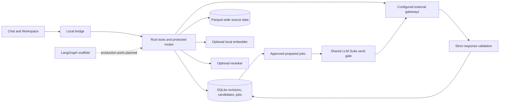

# Screening backend architecture

Rust owns durable criteria revisions, company identity, source observations, candidate history, shortlist selections, approvals, evidence, prepared plans, and execution results. The local UI presents that state and runs review steps. A trusted controller validates and dispatches provider work. LangGraph is an offline workflow scaffold, not a second company database or the current production scheduler.

## Boundaries and status

| Component | Responsibility | Current status |
|---|---|---|
| assistant-ui frontend and local bridge | Criteria and example review, file staging, saved-company review, two next-step groups, screening preparation, Bing preview, chat, session log | Implemented locally; external providers disabled by default |
| Rust domain service and SQLite | Identity, criteria revision approval, considered/hidden membership, source history, plans, shared rate gate, durable jobs and results | Implemented and fixture-tested; migrations through `007_shortlist_review.sql` |
| Parquet | Original wide PitchBook/enrichment columns for later source selection | Implemented local artifact store |
| MID retrieval | Lexical search and model-specific semantic/hybrid paths, 1,000 results per query | Local lexical path implemented; large-corpus recall unverified |
| CPU embedding worker | Replaceable Arctic M v2 INT8 ONNX adapter, 768 dimensions by default | Adapter/worker implemented; real assets and corpus recall unverified |
| Reranker | Replaceable worker contract: retrieve up to 1,000, rerank first 500, keep tail | Adapter implemented; model selection and benchmark planned |
| ISCC, Bing, M365, LLM Suite | External transport and approval contracts | Implemented contracts; live corporate/provider connections unverified and disabled locally |
| LangGraph | Clarification loops, approval interrupts, dependency flow | Offline scaffold tested; production checkpointer, ports, and scheduler planned |

An external path in the diagram means a supported boundary. It does not mean a live request ran. With local defaults, disconnected actions return `executed:false`.

## Criteria and discovery

The UI saves the initial criteria in a backend run before discovery. It presents a business-criteria review, optional separate good-fit and bad-fit example boxes, and final revision approval. Each edit persists a new criteria revision. The latest revision needs analyst approval. Earlier approval cannot authorize work after a criteria change. Rust also keeps profile versions for tool-level discovery; the controller must use the current approved criteria and profile. The local example uses deterministic criteria drafting. The Intake Form opens PDFs and pre-fills fields by label; check each field. Full parsing and live model criteria analysis remain unconfigured.

First discovery searches core products, services, descriptions, and customer problems. Revenue, geography, size, ownership, and classification remain deferred review conditions. Only approved core-business exclusions may narrow this pass. MID and ISCC results keep separate source, query ID, score, and rank. MID search supports lexical, semantic, and hybrid modes when their dependencies are configured. ISCC uses at most five qualitative query variants with at most 14 words and at most 1,000 results per call. The 1,000-result call limit is not a run limit.

Exact ECID/CID references determine company identity; names and websites alone cannot merge companies. Source rows and aliases remain traceable. New discovery adds observations to an existing approved run. It does not replace earlier companies, enrichment, or hidden flags. The saved candidate reader normally returns considered rows; `include_hidden:true` retrieves history. The UI pages the full list with a selection fingerprint. `get_discovery_summary` reports source overlap for considered companies and separately reports saved and hidden totals.

Recommendations use the considered count `n`: PitchBook and Bing for `0 < n < 1000`; ROGO for `500 < n < 2000`; LLM Suite for `n > 2000`; M365 for `0 < n < 250` with PitchBook hydration. Research opens first at `n > 5000`, after any PB/ROGO/Bing hydration, or at `0 < n < 500`. Otherwise enrichment opens first. Both accordion groups remain available, including uploads above 5,000. These strict UI rules are suggestions, not backend filters.

## Shortlist and source truth

The shortlist stores `considered` and a reason per candidate. A review keeps named IDs and hides the others without deleting records. It also stores selected result columns. Screening, Bing company research, discovery counts, and XLSX export use considered candidates. The UI can show all saved rows with hidden flags and let an analyst restore a company. A later search preserves the earlier review state.

PitchBook mapping can hide explicitly unmapped or `Company Profile = No` candidates. An import with `exclude_unmapped` can hide all still-unmapped candidates in that run. A later eligible mapping can restore a row hidden for that mapping reason, and the analyst can restore it manually. Unrelated ROGO imports do not reapply an older PB mapping exclusion. PitchBook and ROGO enrich company context; they do not initiate provider screening. PitchBook PBId comes only from eligible mapping rows; ROGO matches websites with ambiguity checks. Enrichment is currently company-global, while evidence and model results remain run-scoped.

The prepared source projection reads a consistent candidate/data snapshot. Name and website have independent PB→MID→ISCC fallbacks; descriptions retain source labels. Genuine PB LinkedIn can be supplied to M365. Source-specific fields stay blank when absent. Saved RESULTS columns can become input context for a later screening. The source catalog reports coverage; row hashes and candidate/data revisions bind the plan. Full UI preparation currently has a 64 MB snapshot limit. Streaming preparation above that limit is planned.

## Prepared plans and provider execution

A direct LLM Suite or M365 question uses the chat provider route and needs no screening setup. Chat-purpose file attachments are included by default unless the analyst turns them off. When configured, text requests still pass through the strict Rust controller gate; the local disconnected response is `executed:false`.

For scored screening, `propose_prepared_plan` freezes schema-v2 rows, compiled prompt, selected input/output columns, score rules, provider and deployment, batch size, source choices, candidate/data hashes, and adapter configuration. The UI presents input/output chips and an editable prompt, with optional AI prompt drafting when connected. An empty model field resolves to the configured LLM Suite/M365 deployment; otherwise the plan records `automatic`. The controller must never send literal `automatic` as an external deployment. Approval binds the exact digest and creates durable jobs and frozen index maps with `executed:false`. A disconnected provider cannot dispatch them.

Dispatch rechecks freshness and approval. Criteria, source, selection, or model changes require a new preview and approval. A late response from a stale plan stays historical. Model output contains only `index` plus requested columns. Declared fit-score cells accept 0–10 or `CHECK`. Rust validates all rows before accepting any, quarantines invalid output, and permits at most two parsing repairs. All LLM Suite purposes, including orchestration, direct questions, screening, and repairs, share seven actual sends in a rolling minute. M365 has a separate gate. Leases, attempts, audit, and explicit reconciliation protect ambiguous sends; no provider-wide exactly-once claim is made. See [the execution contract](EXECUTION_CONTRACT.md) and [LLM Suite protocol](LLMSUITE_PROTOCOL.md).

## Bing, evidence, export, and recovery

Bing company research uses one to five approved query templates, expands them for **all considered companies**, and previews the exact count. The bridge sends at most 100 requests in a page; the client continues across pages. Fingerprints protect selected companies and exact queries. Disconnected approval remains unexecuted. Bing findings are source-linked unverified leads until an analyst reviews them. A missing answer remains unknown. Retrieval relevance and model confidence never create analyst labels.

`export_candidate_set` writes a new PitchBook, LLM, or Full XLSX for considered companies. Hidden candidates remain in the run and can return to scope. Checkpoints, revisions, shortlist reviews, source observations, receipts, and execution records support recovery. UI discovery jobs are process-local; Rust provider jobs are durable. The local background controller can pause future sends and reconcile uncertain attempts. Production LangGraph ports, corporate adapters, large-corpus retrieval validation, full Intake Form parsing, streaming preparation, and multi-user tenancy remain planned or configured but unverified.

See [the workflow](WORKFLOW.md), [operating instructions](OPERATING_INSTRUCTIONS.md), [retrieval setup](RETRIEVAL.md), and [implementation record](../IMPLEMENTATION.md).
