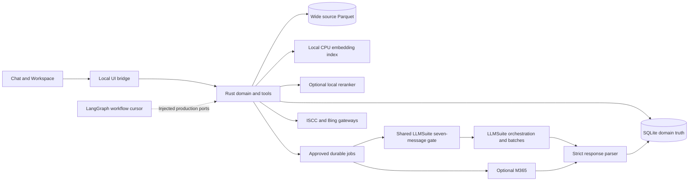

# Screening backend architecture

Rust owns company identity, source observations, screening profiles, candidate membership, approvals, evidence and execution results. The UI displays that truth. LLMSuite interprets and proposes actions; a trusted controller validates, schedules and dispatches them. LangGraph is a workflow cursor, not another company database.

## Boundaries and status

| Component | Responsibility | Status |
|---|---|---|
| assistant-ui frontend and local bridge | Chat, automatic uploads, source selection, exact setup approval, background batches, research and session log | Implemented locally; external providers disabled by default |
| Rust domain service | 65 agent tools, 19 privileged operations, joins, policy, approvals and durable jobs | Implemented and fixture-tested |
| SQLite | Domain truth, immutable manifests, request audit, shared capacity gate, jobs/outbox and accepted results | Implemented; schema version 6 |
| Parquet | Original wide PitchBook/enrichment data for later column selection and joins | Implemented local artifacts |
| MID retrieval | Description-only lexical and model-specific semantic/hybrid search, 1,000 per query | Implemented; actual large corpus benchmark pending |
| CPU embedding worker | Replaceable local ONNX adapter, Arctic M v2 INT8 768D default | Implemented adapter/worker; real model assets unverified |
| Reranker | Replaceable local adapter; rerank 500, preserve tail and source provenance | Implemented adapter; model choice planned |
| ISCC, Bing, M365, LLMSuite | External adapters under explicit deployment settings | Implemented transport contracts; corporate connections unverified |
| LangGraph | Clarification loops, review interrupts and dependency flow through injected ports | Offline scaffold tested; production saver/ports planned |

Solid service boundaries are implemented. The dotted LangGraph production connection remains planned. Corporate paths require configuration and approval; their presence in a diagram does not indicate that a request ran.

## Criteria and discovery

Preserve the original DDI/text and every profile version. The interpretation stage separates core products/services/workflows from geography, revenue, ownership, employee size and classification codes. Show the latter as deferred conditions. Clarify blocking product boundaries, inspect analyst examples if authorized, propose the profile, then pause for analyst approval. Optional M365 criteria analysis retains separate provider attribution before synthesis.

Search approved core-business descriptions in MID and live ISCC. Both default to 1,000 results per query. ISCC queries contain at most 14 qualitative words, usually 10–12, with up to five variants in an approved action plan. MID supports lexical, hybrid and semantic retrieval. Only explicitly approved core-business exclusion terms can narrow the initial funnel; negation syntax in the query is rejected rather than silently excluding businesses. Non-core structured filters are ignored and reported.

Keep retrieval score, query ID, source and rank. MID and ISCC scores have different meanings and are never averaged into a universal fit score. ISCC score-band sampling supports the breadth decision; 0.45 is a possible starting point, not a hard cutoff. A configured reranker scores only the first 500 in one source/query group, sorts that prefix, and preserves the unsent tail. Reranking does not remove candidate membership.

After union/deduplication, show unique count, MID-only, ISCC-only, both and other-source counts. Repeat discovery when the analyst requests more targets. Recommend PitchBook enrichment below 2,000 unique companies and LLM screening at 2,000 or more. The analyst can choose a different next step.

## Identity and source truth

Initial IDs are ECID-CID, X-CID or provisional ECID-X. Missing-marker values are normalized; rows with neither identifier are excluded and reported. Exact cross-references promote aliases. Names or websites alone never merge two company identities. PBId is another cross-reference, populated only from eligible PitchBook mapping rows.

MID is reusable population data. ISCC observations are scoped to the run and query. PB/ROGO enrichments are currently company-global. The prepared projection takes one consistent read snapshot of the selected run: name uses PB then MID then ISCC; website has its own independent fallback; descriptions concatenate labeled PB, MID and current-run ISCC sections. PBId and LinkedIn are supplied only from genuine PB hydration. If PB LinkedIn exists, M365 must receive it. Source-specific extra columns stay blank when the company has no value in that source.

The source catalog lists fields, sample values and nonblank coverage. Selected row hashes plus full candidate/data revisions bind the plan. A legacy compact value is explicitly labeled as legacy data, not represented as a fabricated source observation. Wide PB data stays in Parquet; native Rust joins hydrate only the selected columns. Current full preparation has a 64 MB snapshot limit and fails visibly above it. A streaming preparation service is planned.

## Prepared plans and provider jobs

`propose_prepared_plan` freezes schema-v2 inputs, compiled prompt, output columns, score-column rules, provider/deployment/options, identity/source selection, batch size, profile version, candidate/data hashes, retrieval settings and adapter configuration. The approval preview shows that compiled prompt. The analyst approves its exact digest. Approval atomically creates durable jobs, immutable global index maps and outbox records, but returns `executed:false`.

Scored screening uses 0–10/CHECK only in declared score columns. General questions can return a direct answer without company rows, or unscored index-only company tables. The model returns exactly `index` plus requested columns. Server-side maps join values back to frozen PKs. Strict validation is all-or-nothing; malformed responses go to quarantine and may receive at most two parsing repairs.

Uploads, criteria edits, candidate changes or execution configuration changes require a fresh preview and approval. Dispatch checks the current plan before sending. An already sent response is still retained if an upload races with it, but is historical/ineligible for current use. An old result's frozen PK is not rewritten by later alias promotion.

Jobs have leases, attempts and dispatch audit. LLMSuite capacity is shared by orchestration, all logical subagents, screening, questions and parsing repairs: seven actual sends in a rolling 60-second window. Reservations alone do not authorize a later burst; consume the slot at send time. M365 capacity is separate. Timeouts/5xx/unexpected adapter envelopes can be ambiguous and require explicit reconciliation, not an automatic provider retry. See [EXECUTION_CONTRACT.md](EXECUTION_CONTRACT.md).

## Evidence and memory

Search history stores retrieval provenance. Model assessments store prompt/plan/job/batch output and eligibility. Evidence stores claim, source/reference, confidence, provenance and content hash. New research claims remain UNKNOWN until a privileged analyst review verifies or rejects them. Retrieval relevance or a model's certainty never closes an evidence gap by itself. `label_company` is only actual analyst feedback supplied by the caller.

Durable memory, open questions, checkpoints and recent events help resume a run. The browser session log is presentation state. UI background discovery jobs are process-local; Rust provider execution jobs are durable. The local background controller persists controls and actual dispatch traces, reads lightweight durable progress, pauses future sends, recovers safe expired leases, quarantines ambiguous attempts and stages accepted partial/final records. Definite failures can be explicitly retried through the controller-only route. Do not equate these records with LangGraph checkpoints or claim provider-wide exactly-once execution.

## Orchestration and remaining integration

The offline LangGraph scaffold supplies criteria, discovery, coverage, source-selection and plan-approval interrupts, bounded broaden loops, batch nodes and a direct-question branch. Production must inject a durable checkpointer, stable thread IDs, authenticated review decisions and ports to these Rust APIs. Its demonstration Python queue is not the production scheduler or shared rate authority.

The [local background and upload flow](../../mna-ui/BACKGROUND_SCREENING.md) is implemented against the Rust leases, immutable jobs and shared rate gate. Source inspection reuses the importer; recognized sheets wait for a candidate scope and replay when that scope grows. `/data` reads a fresh table independently of other jobs. Approved manual Bing grounding uses the same registered tools that an LLM can call, and retains unverified evidence provenance.

Next deployment work: validate real Arctic assets/tokenization and corpus recall, select and benchmark a reranker, verify corporate adapter contracts and production scheduler operation, and connect durable LangGraph ports. DDI PDF/DOCX text extraction, advanced natural-language output-schema analysis, streaming preparation above 64 MB, multi-user identity and a source-column analytics engine remain planned. No local generative model is part of the design.

See [the correction table](ARCHITECTURE_CRITIQUE.md), [tool protocol](LLMSUITE_PROTOCOL.md), [retrieval setup](RETRIEVAL.md), [workflow](WORKFLOW.md) and [implementation record](../IMPLEMENTATION.md).
