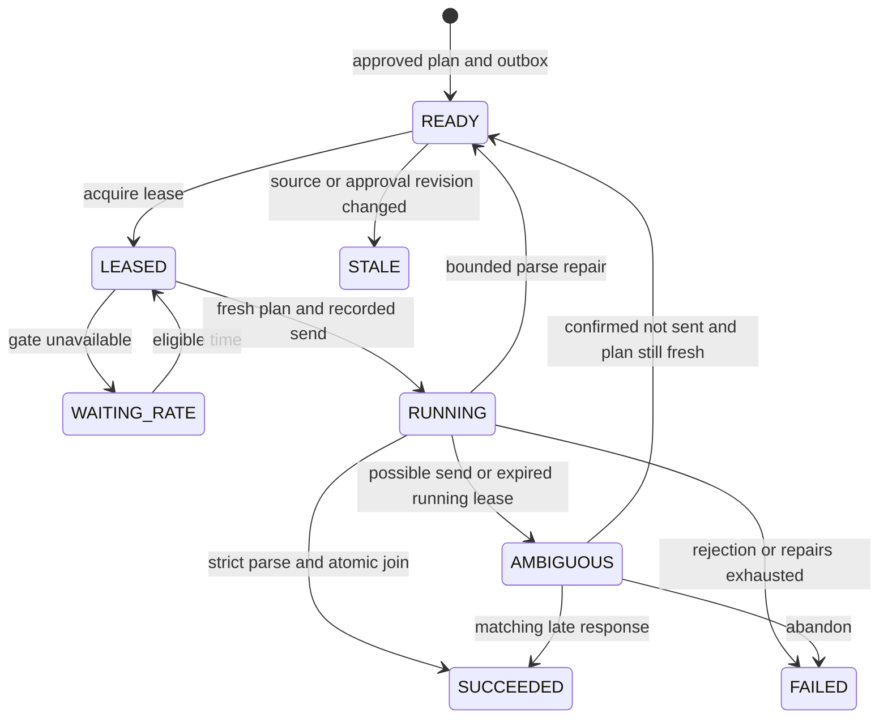

# Prepared-plan and execution contract v2

This contract is implemented in `src/execution.rs`, `src/gateway.rs`, `src/projection.rs`, `src/result_parser.rs` and migrations 004–006. It replaces checkpoint-only preparation for new UI plans. Legacy `prepare_screening_batch`/`save_screening_results` remain compatibility tools; they are not the v2 durable dispatch path.

## Prepare and approve

`propose_prepared_plan` accepts `run_id`, `mode` (screening/question), `provider` (llm_suite/copilot), editable `deployment`, `prompt`, optional `question`, `company_ids`, `input_columns`, `source_columns`, `identity_sources`, `output_columns`, `score_columns`, `batch_size`, `provider_options`, and `retrieval_configuration`. Exact fields and defaults are in [TOOL_REFERENCE.md](../TOOL_REFERENCE.md).

- Screening needs the current analyst-approved profile and companies. Defaults for input are index, pk, PBId, Company Name, Website, Description and LinkedIn URL. Index is always first; removing pk from transmitted inputs does not remove the server's mapping.
- Question mode is unscored. Empty output columns mean one direct text answer; explicit output columns mean strict company tables. A direct question with selected companies must fit one configured batch. No company context is also valid.
- Select explicit source fields as `{source,column}`. Canonical identity source selections default to PB, MID, ISCC. Name and website prefer independently; description concatenates labeled sections. Genuine PB LinkedIn must be selected for Copilot when available.
- Batch size is 1–200, default 50. Output names are ordered, unique, nonblank and free of control characters. Index is reserved and added by the service. Score columns must be requested outputs and exist only in screening mode.
- A blank deployment is allowed while drafting; approval requires a deployment. The plan contains no provider secret. Endpoint/token settings are server configuration.

The schema-version-2 digest binds the normalized specification and source snapshot, including selected values and hashes, profile version, full candidate/data hashes, actual retrieval identity/configuration, provider configuration hash, **compiled execution prompt**, and execution contract hash. The compiled prompt contains the exact output contract and applicable scoring instructions; the analyst sees it before approval. Repair policy (at most two parsing repairs) is part of this contract.

`POST /admin/prepared-plan-approve` records the exact digest, authenticated analyst identity and idempotency key. The same transaction creates jobs, immutable index maps and outbox records. A prepared/approved artifact remains `executed:false` until a dispatch attempt. Approval does not invoke a provider. Freshness is checked again at dispatch; edits/uploads require a new plan and approval.

## Controller routes

These routes require the service bearer token and the separate controller key in `X-MNA-Controller-Key`. They are not agent tools and are not offered to the model.

| Route | Operation |
|---|---|
| `/admin/execution-lease` | Lease an eligible job with owner/token/expiry; consume its outbox entry |
| `/admin/execution-mark` | Verify approved freshness/lease and record a send attempt; consume shared capacity when applicable |
| `/admin/execution-response` | Persist/validate a response for its job and original lease token |
| `/admin/execution-failure` | Mark rate-limited, rejected or ambiguous transport outcomes |
| `/admin/execution-reconcile` | Resolve one matching ambiguous attempt as response_received, confirmed_not_sent or abandon; requires reason |
| `/admin/execution-dispatch` | Invoke the configured generic provider adapter from an eligible lease |
| `/admin/llmsuite-slot` | Reserve a global slot with stable request key and purpose |
| `/admin/llmsuite-consume` | Revalidate/consume that reservation immediately before the actual send |

`GET /agent/tools` serves normal-language tool guidance. `POST /agent/commands` accepts an allowlisted typed text response, checks run scope, validates and executes. It does not accept model-native JSON tool calls. See [LLMSUITE_PROTOCOL.md](LLMSUITE_PROTOCOL.md). JSON at the HTTP transport boundary is deterministic controller data, not the model's command grammar.

## Sending and the shared gate

Use one durable rolling-60-second budget of seven LLMSuite messages across purposes orchestrator, subagent, screening, question and repair. Reserve for scheduling, then **consume at actual send time**. An expired unused reservation is rechecked against the current window. A consumed request key cannot be reused. A confirmed 429 still counts the sent request. WAITING_RATE jobs cannot be leased before their eligibility time. M365 has a separate provider path.

External execution defaults off. Enable only after deployment configuration and actual approval with `MNA_ENABLE_EXTERNAL=true` and `MNA_LLMSUITE_ENDPOINT`/`MNA_LLMSUITE_TOKEN` or `MNA_M365_ENDPOINT`/`MNA_M365_TOKEN`. The generic adapter contract is:

```json
{"contract_version":2,"deployment":"chosen-deployment","prompt":"approved compiled prompt","question":null,"input_table":"selected columns as Markdown","output_columns":["Fit Score","Rationale"],"options":{}}
```

The response envelope is `{"response_text":"..."}`. Only selected input columns go to the model; internal index-to-PK maps stay on the server. Input cells escape Markdown pipes, slashes, HTML and line breaks. Corporate endpoints must implement this generic transport or use a small adapter. Their live behavior has not been verified.

HTTPS is required except loopback HTTP used for local fixtures. Redirects are disabled. Connect timeout is five seconds and request timeout is 90 seconds, below the 120-second lease. No automatic transport retry is performed after a possibly sent request. The successful HTTP response envelope is durably stored as original bytes with SHA-256 before decoding; an invalid envelope becomes AMBIGUOUS and remains available for reconciliation.

## Parse and join

For company outputs, require one Markdown table and nothing else. Its headers are exactly index plus the approved columns in order. Every frozen batch index must appear exactly once, including indexes above one in later batches. Row order can change. PK, company name and website must not be returned unless explicitly requested as output fields; they never control joins.

Missing, foreign or duplicate indexes, duplicate/wrong headers, extra prose/fences, malformed separators, unsupported escapes, or nonfinite/out-of-range scores quarantine the whole attempt. A declared score accepts a number from 0 through 10 or CHECK. No partial company results are committed. The raw response/hash and failure are retained. A parsing failure can request at most two repairs, each a new rate-limited send. Direct answers must be nonempty and have their own repair instruction.

Accepted assessments are immutable and attributed to plan, provider, prompt, job and batch. Replaying an identical accepted response is idempotent; a different response conflicts. Receiving output does not create an analyst label or verified evidence.

## Recovery and historical results



Reconciliation requires `job_id`, exact `attempt`, `outcome`, `reason` and optionally `response_text`. It never automatically repeats a possibly sent provider call. An in-flight response retains its original lease token even if the lease expires. If source data changed while the request was running, its response is retained as historical, the plan is stale and pending jobs cannot continue under that approval. `eligible_for_current_use` is false for stale results and direct answers.

Schema upgrades preserve old approvals/assessments, convert legacy rate timestamps conservatively, and remove company foreign keys from immutable historical index maps. A provisional identity can be promoted later without rewriting what an earlier job actually screened. Quarantined raw responses require controller/operator review; do not turn them into negative fit decisions.

## Limits and honest status

HTTP requests: 1 MiB. Full prepared snapshot: 64 MB. Batch: at most 200 companies. Text/Markdown parser: 256 KiB, bounded rows/fields/depth. Adapter envelope: at most 2 MB. Large workloads require smaller batches or the planned streaming preparation service; the service does not silently drop rows.

`get_prepared_plan` and UI handoffs distinguish prepared/approved from executed. `get_execution_job` reports attempted execution, job state and accepted output separately. `get_model_assessments` exposes eligibility. Provider status/configuration alone is never a result. No corporate provider was called during fixture validation.
