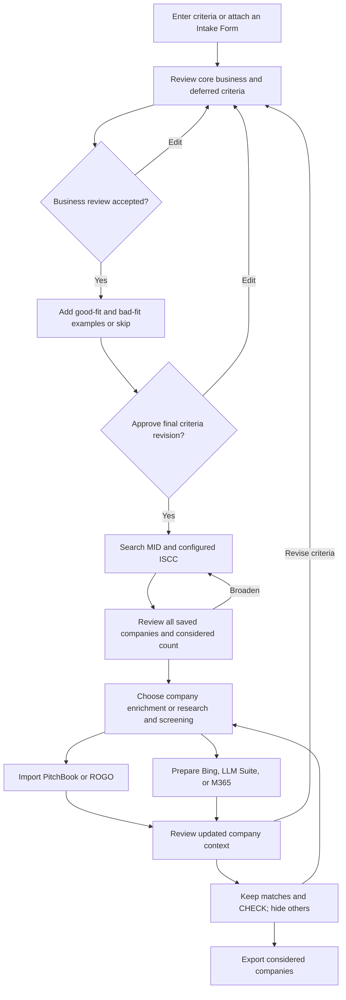

# Screening and research workflow

This document follows the analyst's current local flow. The Rust service owns run, criteria, candidate, approval, source, and result records. The companion UI owns the chat review steps and displays Rust state. The local example can search fictional MID data. ISCC and live LLM Suite, M365, and Bing connections require deployment configuration and have not been verified in this environment. See [the tool reference](../TOOL_REFERENCE.md) for exact arguments.

For the complete analyst/developer walkthrough, hydration and memory rules, worked shortlist example, and actual versus target LangGraph design, read the [application flow guide](APPLICATION_FLOW_GUIDE.md).

## Process map

The analyst can return to criteria from any later point. Each edit is saved as a new database revision. The last revision needs its own approval. An old approval or prepared execution plan cannot authorize work for changed criteria; prepare and approve affected work again. Saved companies, source observations, hidden flags, and historical results remain available for review.

## 1. Review and approve criteria

Enter a core-business description or attach an Intake Form. A PDF opens and pre-fills fields by simple label match; check each field. Full parsing is deferred. Local UTF-8 TXT can supply a draft. Keep revenue, size, geography, ownership, and industry codes visible as later review conditions. Do not use them to narrow the first discovery search. Only analyst-approved core-business exclusions may narrow it.

First review the business criteria. Then enter optional good-fit and bad-fit examples in separate boxes, or skip both. Review the final combined criteria and approve that revision before discovery. The UI saves each draft to a Rust run before discovery and records approval through the protected criteria route. The agent cannot approve its own proposal. A changed final revision needs another approval. The local example uses deterministic drafting; live model interpretation remains unconfigured.

## 2. Discover broadly and preserve source truth

Search products, services, descriptions, and customer problems in MID. Search ISCC only when its corporate gateway is configured. MID lexical search works locally; semantic and hybrid retrieval need current compatible embeddings. The replaceable Arctic M v2 INT8 adapter specifies 768 dimensions, but real model assets and corpus recall remain unverified. A pluggable reranker has no selected production model. Its contract accepts up to 1,000 results from one source/query group, reranks the first 500, and preserves the remaining tail. These per-query limits do not cap a run's total companies.

ISCC queries use no more than 14 qualitative words, normally 10–12, with at most five distinct variants in an approved plan. Each MID or ISCC query returns at most 1,000 results per call. Page or vary queries to widen coverage. ISCC relevance samples can guide breadth; a score such as 0.45 is not a fit cutoff. Keep MID and ISCC scores, query IDs, rank, and provenance separate. Never average retrieval scores into a screening fit score.

Normalize ECID and CID into a stable company ID. An exact identifier bridge may promote an alias; a similar name or website alone cannot merge companies. Add candidate observations without replacing earlier rows. `get_discovery_summary` counts **considered** candidates by MID-only, ISCC-only, both, and other source. The saved history also reports hidden candidates. A repeat search adds new candidates to the approved run and retains earlier company data and manual hide decisions. The UI pages the complete saved list, including hidden rows, for history.

The local example imports fictional MID data into the criteria run. It does not simulate ISCC or provider research. A larger run can contain more than 1,000 saved candidates; the UI reads the saved shortlist in pages and checks the selection fingerprint between pages.

## 3. Review companies and choose the next step

Use the **considered** count for recommendations. Hidden companies remain in history but do not enter current screening, research, or export scopes. The options appear in two independently openable groups: **Company enrichment** (PitchBook, ROGO) and **Research and screening** (LLM Suite, M365, Bing). The analyst can choose any available option; recommendations do not enforce an action.

| Condition on considered companies `n` | Recommendation or default view |
|---|---|
| `0 < n < 1000` | Recommend PitchBook and Bing. |
| `500 < n < 2000` | Also recommend ROGO. |
| `n > 2000` | Recommend LLM Suite screening. |
| `0 < n < 250` and PitchBook context exists | Also recommend M365. |
| `n > 5000`, or any PB/ROGO/Bing hydration exists, or `0 < n < 500` | Open **Research and screening** first. |
| All other counts | Open **Company enrichment** first. |

These comparisons are strict. At exactly 500, 1,000, 2,000, 5,000, or 250, use the applicable other conditions. The enrichment group remains available when collapsed, including above 5,000. The older general rule “enrichment below 2,000, LLM at 2,000 or more” does not describe the current UI.

For example, a broad search might produce **2,500** considered companies. Screening and further review can reduce the active set to **400**, then **150**, then **55**. At 2,500, LLM Suite is recommended. At 400, research opens first and PitchBook/Bing are recommended. At 150 with PitchBook context, M365 is also recommended. At 55, export only the companies still considered. These counts illustrate decisions; they are not automatic filters or target quotas.

## 4. Add company context

Drop PitchBook or ROGO CSV/XLSX files into the enrichment step. The importer identifies sheets from headers. PitchBook mapping must have the required eight-column header; only `Company Profile = Yes` can add PBId. A new mapping can automatically hide explicitly unmapped or `No` rows, and its `exclude_unmapped` option can hide all still-unmapped candidates in that run. The analyst can restore a company manually. Historical rows and review decisions remain saved. An unrelated ROGO upload does not reapply an old PitchBook mapping exclusion. PitchBook data joins by PBId; ROGO matches websites and does not replace unrelated company data.

PB and ROGO drops add company context. They do not themselves ask a model to screen companies. A later screening preparation can choose which source columns to include. Source descriptions remain labeled, and the analyst can select saved **RESULTS** columns as new context for another pass. A changed source or candidate selection makes an old prepared plan stale.

## 5. Ask, research, screen, and review again

The analyst can ask LLM Suite or M365 a direct question in chat without opening screening setup. Chat-purpose attachments are included by default; turn off a file's provider toggle to omit it. The local bridge returns `executed:false` when the provider is disconnected. Provider text requests still pass through Rust's strict controller gate when configured.

For scored screening, choose the provider, input and output column chips, and prompt. The UI can request an AI draft of the prompt when a provider is connected. An empty model field uses the configured provider deployment when present; otherwise the prepared plan records `automatic`. Approval binds the exact compiled prompt, input rows, columns, model choice, and digest, and creates durable jobs with `executed:false`. `automatic` is never sent as a literal external deployment. A disconnected service cannot execute a prepared job. The output uses only `index` and requested columns; declared fit scores must be 0–10 or `CHECK`. Rust validates the whole response, maps indexes to frozen company IDs, quarantines invalid output, and allows at most two parsing repairs. All LLM Suite sends, including repairs and other purposes, share seven actual sends per rolling minute. See [the execution contract](EXECUTION_CONTRACT.md) and [protocol](LLMSUITE_PROTOCOL.md).

For Bing, write **one to five** query chips, or request AI query suggestions when connected. Company research expands the approved queries for **all considered companies**, using a preferred name and website. The UI previews the exact request count and samples. The local client sends up to 100 queries per page and continues through the saved request list automatically. Disconnected approval remains `executed:false`. Saved web findings are source-linked **unverified research leads**, not analyst fit labels.

After any research or screening pass, inspect company context and results. Keep strong matches and `CHECK` cases for further work; hide others through shortlist review. Select useful RESULTS columns for another screening, add source data, run more queries, or edit and reapprove criteria. Keep provider scores and each query's retrieval scores separate. A missing answer stays unknown.

## 6. Export and resume

Export **considered** candidates as PitchBook, LLM, or Full XLSX. Compact sheets contain one row per considered company. Full export retains selected MID and current-run ISCC source rows for considered companies. Hidden rows stay in the run's history and can be restored; they are outside the current export. The service creates a new artifact instead of overwriting an earlier one.

Use saved criteria revisions, shortlist selections, source observations, checkpoints, jobs, and receipts to resume. A local UI discovery job is process-local; Rust's provider execution ledger is durable. Reconcile an ambiguous provider attempt before retrying it. A saved result from a now-stale plan remains historical and cannot silently become current. Production LangGraph scheduling, corporate gateways, full Intake Form parsing, live provider configuration, and multi-user tenancy remain separate deployment work.
