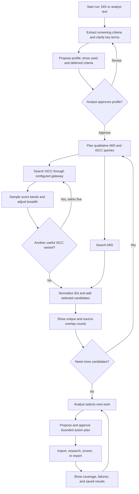
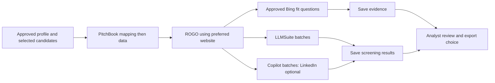

# Screening and research workflow

This is the full analyst journey. The Rust service implements the named tools, storage, joins, approval checks, exports, and handoffs. The companion UI implements local review and preparation. DDI text extraction, the corporate ISCC browser bridge and live providers remain deployment integration work. See [the tool reference](../TOOL_REFERENCE.md) for exact arguments.

## First-pass rule

Find businesses by what they do: descriptions, products, services, customer problems, and approved examples. Keep the first funnel broad. Record financial, size, geography, ownership, and classification criteria in the screening criteria, but do not use them to search or filter during discovery. The service accepts some legacy filter fields, ignores these non-core fields, and returns `ignored_search_filters`. The controller must identify such constraints in free text and show them to the analyst. A retrieval score is a ranking aid, not a fit decision.

## End-to-end flow

MID and ISCC may run independently after approval. A dependent action waits for its inputs. The controller uses checkpoints and receipts to resume work. The companion interface displays local review points; live agent orchestration still requires production ports.

## 1. Start and approve criteria

The analyst uploads a DDI or enters plain text. A separate extraction component reads a PDF or Office DDI. The controller preserves the original criteria and source reference, then proposes a screening profile. It lists desired business activities, core-business exclusions, positive and negative examples, unclear terms, and deferred non-core criteria. It asks focused questions when an answer could change the search. A skipped question remains open; a blocking uncertainty requires an answer or an explicit assumption before approval.

A new run has a PROPOSED/DRAFT profile. The analyst must approve the final profile through `/admin/profiles/approve` before MID, ISCC, or similarity discovery. A direct instruction from the analyst can be recorded by the trusted controller without a second approval prompt. The agent cannot approve its own proposal. On migration, old approvals marked `system_initialization` become PROPOSED; true analyst approvals remain valid.

Named examples can be inspected with `find_company`. If an agent suggests external Bing clarification, show the proposed action for human approval. A direct analyst request for the research is the approval decision, subject to the deployment's external access settings. A research finding does not create an analyst label.

## 2. Discover in MID and ISCC

MID is the large company population. Import actual MID files through `/admin/company-files`, then use `search_mid` for keyword, semantic, or hybrid discovery. Use the example-similarity tools for approved examples. Configured semantic/hybrid search embeds queries through the replaceable local worker and uses its model-specific index. Without that worker, semantic search is unavailable and hybrid may use its reported lexical fallback. Use several focused queries for a broad screening criteria. Local search defaults to and allows up to 1,000 results per call and offset up to 1,000,000; use pages and the optional Meilisearch projection for large runs. Record each query ID, rank, score, and source observation. Only approved core-business exclusions may narrow this pass. Non-core filter fields are ignored and reported.

ISCC is an external export gateway. `search_iscc` sends only `query` and `limit` to the gateway, then normalizes returned rows. The query normally has 10–12 qualitative words and must have at most 14. The default limit is 1,000 and the maximum is 1,000. A plan may use up to five distinct variants. The corporate browser/CDP automation and Excel/CSV conversion belong in the external bridge; the Rust service does not implement the unknown corporate protocol.

ISCC rows can contain ECID, CID, name, website, HQ city/state, description, and relevance score. Use `get_iscc_score_samples` to inspect about three or four descriptions around each available score band from 0.9 through 0.3. Choose breadth from the descriptions. Around 0.45 can be a starting point, never an automatic cutoff. Keep lower-score source observations even if they are not selected into the current candidate set. A gateway failure is an error, not an empty result or negative evidence.

## 3. Resolve identity and review candidates

| ECID | CID | Internal `company_id` / export `pk` |
|---|---|---|
| Present | Present | `ECID-CID` |
| Missing | Present | `X-CID` |
| Present | Missing | `ECID-X` (provisional) |
| Missing | Missing | Exclude the row and report it |

Normalize null markers, spaces, and case; retain raw IDs. Exact identifier bridges can promote a provisional identity while retaining aliases and dependent references. Conflicting pairs are quarantined. A name or website match alone never merges companies. `get_company_identifiers` shows exact IDs and aliases; `get_source_rows` shows original JSON, source, query, and run provenance. The current source-row record does not persist original file, sheet, and row locators.

Add selected IDs with `add_candidates`, using their query/source provenance. One company appears once in the run even if several queries or both sources found it. The compact common view prefers usable MID values for name, website, HQ, and description, while retaining ISCC observations. `get_discovery_summary` reports unique total, MID-only, ISCC-only, both, and `other`. `other` covers candidates without a matching MID row or current-run ISCC row, including legacy records. The four source groups sum to the unique total. Show excluded rows and identity conflicts separately. If the analyst wants more targets, search again and add new candidates without erasing earlier observations.

At review, show the approved profile, deferred criteria, counts, search coverage, and uncertainties. Recommend PitchBook enrichment when the unique count is below 2,000; recommend LLM screening at 2,000 or more. These are suggestions. The analyst can select enrichment, Bing research, LLM screening, M365 research, Copilot screening through a surrounding service, or export. The companion UI displays these decisions as chat/workspace artifacts.

## 4. Select actions and enforce dependencies

An analyst can select an option or say, for example, “Import PitchBook and ROGO, then run Bing questions.” Convert that request to an immutable `propose_action_plan` graph. The graph has 1–20 typed steps, dependencies, a current approved profile version, and company scopes of at most 2,000. The administrator approval route records the human decision; direct analyst instructions do not need a redundant question. An agent suggestion for an external action needs a human decision. `get_action_plan` shows state and dependencies.

Mapping must precede PitchBook data hydration. ROGO can depend on the resulting PitchBook website. A screening batch waits for the enrichment it uses. Independent discovery or research calls may run in parallel, but a dependent plan step waits for successful predecessors. The supported execution calls create successful operation receipts. `complete_action_step` accepts matching successful receipts and refuses an incomplete or mismatched scope. For `search_mid`, completion uses MID search receipts only. Failed operations do not create success receipts. Profile changes make an old plan stale; propose a new plan.

## 5. Import enrichment files

`import_enrichment_files` accepts mixed CSV/XLSX uploads and classifies headers, not filenames. The aggregate limit is 250,000 rows per import. The companion UI stages uploads and supplies download controls. The tool reports row counts separately from distinct-company coverage, along with skipped, unmatched, and ambiguous rows. `pbid_populated` counts only newly added PBIds. Enrichment fields are global company data; screening scores and evidence remain run-scoped.

A PitchBook mapping CSV requires its full eight-column header in row 1: `pk`, `PBId`, `Firm Name from PitchBook`, `Website from PitchBook`, `Company Profile`, `Investor Profile`, `Limited Partner Profile`, and `Service Provider Profile`. Only `Company Profile = Yes` can add PBId. A PitchBook data XLSX can have a later header row; the importer detects the real header and ignores copyright text for any four-digit year. It joins through PBId, keeps seven compact fields—`PB_Website`, `PB_Name`, `PB_Description`, `PB_LinkedIn URL`, `PB_HQ Location`, `PB_Active Investors`, `PB_Universe`—and writes all wide data columns to real Parquet.

For ROGO, the importer finds the topmost website header across sheets. It prefers a usable `PB_Website`. If that value differs from the original website and finds no ROGO row, it **does not** fall back to the original website. The original website is used only when the PB website is missing or the two normalize to the same value. Ambiguous matches are quarantined. A mixed upload is processed in mapping → PitchBook data → ROGO order.

## 6. Export the candidate set

`export_candidate_set` exports **all candidates across statuses**. It creates a new XLSX artifact and will not overwrite an existing filename. It has no formal candidate-set version or manifest. Use checkpoints and the returned artifact/receipt to avoid creating another export during recovery.

| Type | Exact sheet and columns | Rows |
|---|---|---|
| PitchBook | `PITCHBOOK`: `pk`, `Company Name`, `Website`, `HQ City`, `HQ State`, `Source` | One per unique candidate |
| LLM | `LLM`: `index`, `pk`, `Company Name`, `Website`, `Source`, `Description` | One per unique candidate; index 1 through N |
| Full | `MID` and `ISCC`: `pk` first, then all original source columns | Selected original source rows; ISCC rows from the current run |

MID values lead the compact exports when both sources have the field. In a Full Export, a company seen in both sources can appear on both sheets. The controller can offer these three choices in an Export dialog; that dialog is not part of the Rust service.

## 7. Screen and research

`propose_prepared_plan` creates a schema-v2 scored-screening or question setup. Select source columns, review independent PB name/website fallbacks and labeled descriptions, choose output columns, deployment and batch size (1–200), then inspect the complete compiled prompt and actual input preview. The analyst approves the exact digest. Rust atomically creates durable jobs and frozen index-to-PK mappings with `executed:false`. Only a configured trusted controller can dispatch. LLMSuite shares seven actual sends per rolling minute across all purposes; M365 LinkedIn is optional unless genuine PB LinkedIn is available, when it must be included. Strict index-only Markdown parsing accepts all rows or quarantines the whole response and allows at most two repairs. Uploads or edits require fresh preparation/approval. Late responses to a changed plan remain historical. Read [the execution contract](EXECUTION_CONTRACT.md) for recovery. Legacy scored-batch tools remain available for compatibility, not as the new UI dispatch path.

For Bing, prepare three to five approved fit questions. `prepare_bing_queries` expands them for scoped companies using preferred names and websites. Call each exact company/query pair with the matching plan and step. Completion requires a successful receipt for every pair. Save useful claims with `save_evidence`; a missing answer is unknown. M365 local `company_ids` derive one gateway `companies` string per company from its preferred name, website, and canonical ID. An explicit `companies` list must be omitted or match that derived list exactly. Only `question`, `companies`, and `required_fields` reach the gateway. Structured `run_id`, `plan_id`, `step_id`, and `company_ids` fields stay local, but the derived gateway strings include canonical IDs as text.

## 8. Resume and revisit

Save checkpoints at review boundaries. On resume, read the approved profile, action plan, receipts, batches, query history, imports, and existing exports. Retry only confirmed-unsent or missing work. Reconcile ambiguous provider attempts before any resend. A local successful receipt and saved result help avoid repeated work, but the service does not provide a provider-wide exactly-once guarantee. A changed profile needs fresh plan review. Later human research can update a candidate status; only actual analyst feedback may create an analyst label. Preserve source observations and unanswered questions throughout the run.

## 9. Use loops and dependency graphs

Use a loop when an answer can change the next question or query. Use a dependency graph when one action needs the output of another action. Rust validates stored graphs and completion receipts; the surrounding controller schedules them. Keep loop counters, query IDs, pending questions, and batch IDs in checkpoints.

| Loop | Repeat when | Stop or pause when |
|---|---|---|
| Criteria clarification | A business term, example, or product boundary remains unclear. | The analyst approves a profile, or a blocking question needs human input. Keep skipped nonblocking questions open. |
| MID discovery | Another keyword, semantic page, or example can add useful breadth. | The agreed discovery budget is reached or the analyst accepts the set. Rust does not choose that budget. |
| ISCC discovery | Another qualitative variant covers a distinct part of the screening criteria. | The plan's five-variant limit is reached or further pulls no longer add useful coverage. |
| Score calibration | Descriptions near a relevance boundary still show possible business fit. | The agent can explain the selected range to the analyst. Relevance alone never verifies a company's fit. |
| Candidate review | The analyst asks for more targets or changes the core-business scope. | The analyst chooses the next actions. A changed profile requires fresh approval and plans. |
| Screening batches | Approved companies still lack saved results. | Every scoped company has a result, or a failed batch needs correction. Prepare at most 200 companies per batch. |
| Evidence research | A core-business question lacks sufficient support. | Approved questions have been attempted and their receipts cover every company/question pair. Unanswered questions remain unknown. |
| Recovery | A saved plan has incomplete work. | Existing results and receipts account for the work. Retry only missing work under the current profile. |

For example, an analyst's instruction to enrich and then screen can form this graph:

The graph shows possible branches. Include only the actions the analyst selected or approved. If screening uses Bing answers, add a dependency from the Bing step to that screening step. Otherwise independent research and screening branches can run concurrently. The controller schedules work; Rust validates plans, approvals, and completion. Show coverage, failures, and deferred criteria at each human review boundary. An analyst can choose a single action, several ordered actions, or another discovery loop in plain text.
