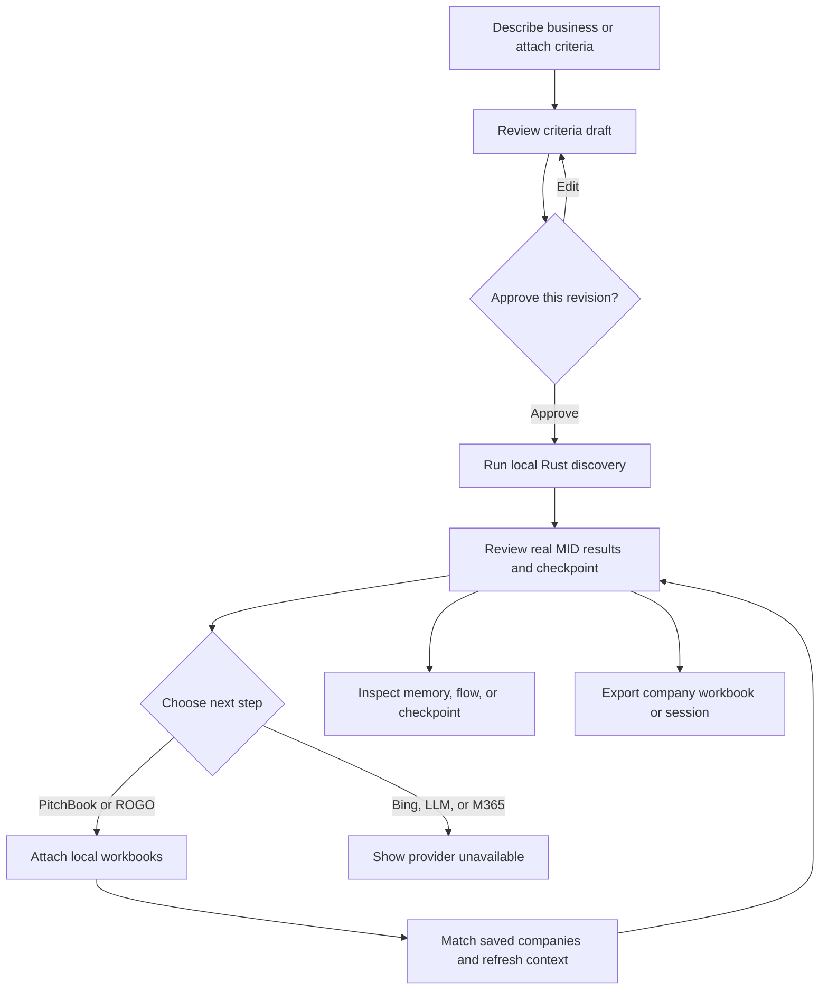

# Screening design and architecture

Screening has two views of one workspace. Chat is the starting surface, and the header is the sole Chat/Workspace switch. Workspace presents Overview, Companies, and Files beside that same assistant on desktop. A screening owns its criteria revision, approval, messages, files, current companies, job, artifacts, and Rust run reference. Both views use the same sidebar, header, attachment runtime, tool activity, and session log. The dock can expand or restore, and full Chat remains the same mounted runtime.

Geist carries working text, controls, and tables; Manrope carries headings. Both variable fonts are served locally through installed Fontsource packages. The light theme uses neutral surfaces and the requested `#8F5A39` accent. Dark mode uses charcoal surfaces and a lighter shade of brown for legible controls. Green indicates success or approval, red indicates failure, amber indicates review or attention, and blue indicates running or informational state. Labels accompany color. MID and ISCC source scores remain separate.

`src/theme/theme.css` owns shared tokens. Light, Dark, and System preferences are saved in `screening-appearance-v1`. An early HTML script sets appearance before React paints. System follows operating-system changes; explicit choices override them. Theme switching remains usable if browser storage is unavailable. Mermaid rendering is serialized because configuration is global, and diagrams refresh when appearance changes.

## User flow

**Run the example** (or `/example`) prepares a fictional insurance-software criteria draft. It does not run discovery until the analyst approves the current criteria card. Approval is revision-specific; editing criteria clears approval and current displayed results. A successful Rust job creates company and checkpoint artifacts plus a **Choose the next step** options artifact. **Not now** defers; PitchBook and ROGO imports continue through local file staging and Rust. **Prepare Bing research** only drafts questions, and unsupported providers remain unavailable.

## Runtime and component boundaries

`src/WorkspaceApp.tsx` is a view of the shared chat state and callbacks. It has no second assistant runtime or tool runner. Switching views keeps the same chat mounted, preserving drafts, attachments, queued messages, and a running turn. Changing screenings creates an isolated runtime and draft. Workspace exports select the current run and exact current company set; historical chat exports remain scoped to their result card.

Overview shows criteria, source counts, progress, and next-step options. Companies uses AG Grid Community with sorting, per-column filters, resizing, native keyboard navigation, virtualization, separate MID/ISCC scores, and page sizes of 25, 50, or 100 (50 default). Workbook exports use the full current result set, independent of table filtering and pagination. Files shows upload artifacts and import status and opens the same assistant-ui attachment picker. A file drop area covers the main content and adds supported files to the active chat using its attachment adapter; drop itself neither sends nor approves. Pending PDFs use a caller-owned blob URL for preview. Container queries stack inner panels when the desktop dock leaves limited space. Below 1001px, the hidden chat is inert, and actions that need the assistant open Chat. Collapsed navigation is inert and returns focus to its reopen control.

`src/chat/ChatThread.tsx` builds the thread around assistant-ui LocalRuntime, thread/message/composer primitives, attachments, message editing and actions, branching, queue controls, error UI, and scroll behavior. The application adapter in `src/lib/chat-driver.ts` interprets supported local commands and calls the job service. Assistant text uses `src/chat/MarkdownMessage.tsx`; custom tool-call and grouped-tool renderers keep call arguments, outputs, status, and duration visible.

Commands execute their selected action immediately. The searchable prompt library instead lets the user edit a template and inserts it into the composer without sending. Shared selects use styled Radix controls with light/dark appearance and keyboard-accessible interaction. PDF artifacts and pending PDF attachments use `src/files/PdfPreview.tsx` and PDF.js 6.3.289 to render original bytes locally. The viewer offers page navigation and entry, fit width, 25–300% zoom, rotation, expand/restore, open/download, and load/render retry. It does not extract text or add a text-selection layer. Upload limits are enforced by the existing attachment adapter and local file path.

`src/chat/ArtifactCard.tsx` renders screening-domain cards: criteria and approval, source-counted company results, next-step options, plans and Mermaid diagrams, research-question drafts, saved company context, jobs, checkpoints, files, and provider handoffs. These are app components informed by the assistant-ui Elements catalog; the app does not install or claim to ship each catalog element as a canonical component. `/flow` is a public process overview, not hidden model reasoning or a live graph of every operation.

The sidebar and inspectors in `src/App.tsx` navigate local screenings and expose context, artifacts, and background jobs. `src/lib/chat-store.ts` persists screening state in browser local storage. `src/lib/session-store.ts` keeps a separate browser-local event ledger. `src/chat/SessionTiming.tsx` plots recorded spans, defaults to selected-turn scope, and lets analysts select events; `src/SessionLog.tsx` supplies search, filters, event inspection, pagination, and export. Mobile log navigation switches between Activity and Record details.

The tool timeline groups consecutive tool calls, shows the latest four by default, and expands to the rest. Timing visuals mark recorded event points and durations; they do not imply a duration where the event data has none. Errors use semantic error styling. The DeepSeek-inspired part is the inspectable event ledger and timing view: records grouped by turn, with selectable inputs, outputs, and recorded durations. It is not a nested span tree or a DeepSeek Harness runtime. There is no DeepSeek provider, harness connection, or external agent.

## Rust bridge and background jobs

`server/start.mjs` starts Vite and the local bridge. `server/bridge.mjs` launches the existing Rust executable with an isolated SQLite database, import/export roots, generated server-only credentials, and external providers disabled. It forwards only an explicit allowlist and accepts staged file IDs instead of caller-supplied filesystem paths.

`server/jobs.mjs` runs discovery as a process-local background job. Jobs outlive their initiating HTTP request and are polled by the chat. Switching screenings or reloading can reconnect to a still-running job while the local server remains up. A server restart ends in-process jobs; completed Rust writes and checkpoints remain durable. `src/lib/chat-jobs.ts` maps actual job events into visible tool-call parts and session receipts, then adds company and checkpoint artifacts on completion.

The example uses fictional MID rows and real Rust operations. Its job creates a run, imports the fixture, applies approval from the analyst’s explicit UI action, reads the approved profile, searches MID, saves candidate IDs, reads company/source/context records, counts the result, and saves a checkpoint. ISCC is not called by this local workflow. The assistant’s local command matching and criteria drafting are deterministic; they are not LLM inference.

## Files and recovery

Uploads are size-limited and staged by the local server from either Chat or Workspace; the original bytes are retained and the resulting file artifacts appear in chat. Workspace docks the same assistant on desktop, and opens Chat for mobile uploads. CSV/XLSX enrichment can import after a completed, currently approved run. The importer identifies PitchBook mapping/data and ROGO workbooks by headers. TXT files may supply a short UTF-8 excerpt to local criteria drafting. PDF and DOCX bytes can be retained as artifacts, but this app does not extract their text.

The browser stores chat and session history; the server stores uploaded original bytes and Rust data. Markdown and JSONL session exports include recorded events but omit upload bytes. Full ZIP fetches the actual original bytes referenced by declared upload artifacts from the local server and includes them with the transcript, every event (regardless of visible filters), and manifest. ZIP creation therefore requires the local server and files to remain available and enforces a 40 MB aggregate upload limit. It does not include external subagent sessions because none are connected.

Stopping cancels pending requests or the active local job and preserves completed writes. Criteria edits invalidate approval. The checkpoint command inspects the saved Rust state; it does not restore browser state or roll back a run.

## Current integration boundaries

There are no connected external LLMs, web search, ISCC, LLMSuite, OpenAI, DeepSeek, M365 Copilot, or external subagents. Bing steps display fit questions without running a search. The model selector labels providers as unavailable. The UI makes those boundaries visible and does not fabricate results, scores, approvals, or agent activity.

See [ELEMENT_COVERAGE.md](ELEMENT_COVERAGE.md) for a component inventory, [UI_GUIDE.md](UI_GUIDE.md) for the manual path, and [VALIDATION.md](VALIDATION.md) for the current verification record.

PDF previews open in Chat, leaving the same assistant runtime mounted. The bundled PDF worker, character maps, standard fonts, and image decoders are served locally. Pending-file URLs are released on close or replacement. Supporting-file notes preserve the approved criteria and current result set; an explicit new business request prepares a new draft.

Motion uses ordinary CSS opacity and color changes. Menus fade briefly, and small loaders rotate in eight discrete steps per 1.2-second loop. Status pulses continue to loop, using stepped opacity instead of animated shadows. Large panel slide animations, backdrop blurs, hover brightness filters, and AG Grid row animations are removed. PDF.js explicitly disables hardware acceleration and uses a standard 2D canvas with a readback-friendly context. Diagrams remain SVG. The operating system's reduced-motion preference disables animations and transitions, including status pulses; no WebGL context is required for the interface.
