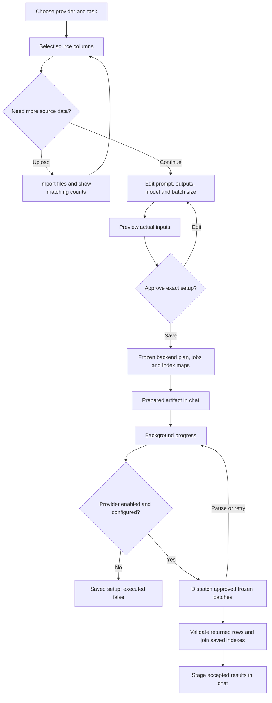

# Screening and question setup

Use **Screen / ask** in the header, **Configure** on the next-step card, or `/llm`, `/copilot`, and `/screen` in chat. The chat commands create a setup card; **Review setup** opens it. The setup supports LLMSuite and M365 Copilot separately, with scored screening or a general question. LinkedIn is optional; when genuine PitchBook company LinkedIn is hydrated, Copilot must receive it. Model/deployment names are editable because the available deployments will be supplied later. External execution is disabled by default. The approved setup starts in the background only when its provider is configured and explicitly enabled; otherwise it remains an unexecuted saved setup.

1. Choose **Screen companies** or **Ask a question**. Scored screening requires an approved business definition and a saved company set. A general question can be prepared before a search; without a company set it represents one question rather than per-company scores.
2. Review input columns. `index` stays first. The seven defaults are `index`, `pk`, `PBId`, `Company Name`, `Website`, `Description`, and `LinkedIn URL`. The server retains pk even if you remove it from the model inputs.
3. Select **Add sources**. MID, ISCC, PB, and ROGO tabs show original field names, nonblank company counts, and sample values. Checkboxes add explicit source columns; missing source values remain blank. Canonical name, website, and description have separate source choices. The default name and website order is PB → MID → ISCC, independently. Description concatenates source-labeled PB, MID, and current-run ISCC descriptions.
4. If PB or ROGO is missing, drop CSV/XLSX files into that tab or choose files. Review the pending list and select **Upload and populate**. Header-based classification identifies the data; filenames and the selected tab do not override classification. PitchBook normally needs a mapping CSV plus one or more data workbooks. Uploaded files use the same automatic detection/import pipeline as chat and workspace uploads. The catalog and company context refresh after import; the side panel records actual matched/unmatched counts. Use `/data` to view the current table in chat. An upload does not prove that any company matched.
5. Edit the comma-separated output columns. `index` stays pinned. Scored defaults are `Fit Score, Rationale`; question defaults are `Answer`. **Suggest from request** uses a transparent local drafting rule, including explicit `Output columns: Product, Evidence, Confidence`. The future budgeted schema-analysis node will interpret broader natural language; there is no hidden model call now.
6. Enter a deployment name, adjust batch size from 1 to 200, and edit the recommended prompt. Scored prompts recommend 0–10 and `CHECK` for missing/conflicting information. General questions do not add scoring. The requested output contains only index and the chosen result columns; original company identity is joined by the server's frozen mapping.
7. Select **Generate preview** to read actual values. Review the complete compiled prompt, sample rows, blank-field warnings, total company count, batches, and output headers. The LLMSuite dispatch estimate assumes an otherwise idle shared seven-message rolling-minute budget. Orchestrator work, subagents, questions, and retries also consume that budget; processing time is additional. M365 capacity is not inferred from LLMSuite's limit.
8. Select **Approve and save setup**. Input data, configuration, provenance, and index mapping are stored in backend prepared-plan, job and immutable index-map tables. The saved artifact appears in chat and the session log includes actual source-read, prepared-plan and approval calls. **Edit a new version** opens the configuration, but requires a new preview and approval. A data or criteria change invalidates an unsaved preview.

9. Expand **Background screening** at the bottom right to check each provider's recorded progress. Pause future batches, retry definite rejected batches, or stage accepted partial/final results as a chat table. A source change requires fresh preview and approval; historical counts remain visible after restart. See [BACKGROUND_SCREENING.md](BACKGROUND_SCREENING.md) for recovery and failure behavior.

The source-aware preparation endpoint reads the full candidate set with keyset pagination. It never treats a first page as the full set. The current local service limits a preview snapshot to 64 MB and stores authoritative inputs in backend prepared-plan tables; its short-lived cache holds preview references. Oversize data fails visibly; it is not silently reduced. PB/ROGO are currently company-global enrichment, while ISCC is run-scoped. The browser ledger is presentation state; it does not replace the backend's frozen prepared inputs. Durable plan/result tables, leases/outbox, strict result parsing and the generic provider adapter are implemented in the backend. Local background controls are implemented. Connected lifecycle checks use loopback mocks; no corporate provider was called. Corporate deployment validation, production multi-worker scheduling, multi-user identity and connecting LangGraph remain integration work. See [backend architecture](../mna-tools/docs/BACKEND_ARCHITECTURE.md), [critique](../mna-tools/docs/ARCHITECTURE_CRITIQUE.md), and [LangGraph scaffold](../mna-orchestrator/README.md).
